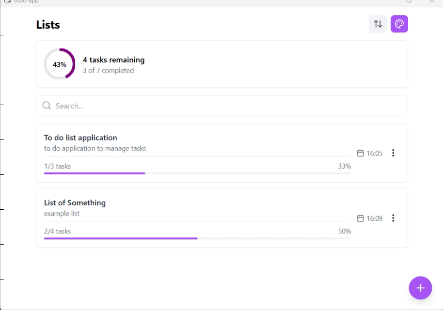

# To-Do App

To-Do is a modern, responsive task management application built with React, TypeScript, and Tauri. It allows users to create, manage, update and delete, theme customization, and local data persistence using `sql.js`.

## Demo Running


## Features
- **Task Lists and Tasks**: Create, read, update, and delete (CRUD) task lists and tasks.
- **Prioritization**: Assign priorities (High, Medium, Low, None) to tasks.
- **Search**: Filter lists by title, description, or task content.
- **Theme Customization**: Choose from multiple color themes to personalize the app.
- **Progress Tracking**: Visualize task completion with progress bars and statistics.
- **Responsive Design**: Works seamlessly on desktop and mobile devices.
- **Local Persistence**: Data is stored locally using `sql.js` and `localStorage`.
- **Error Handling**: Robust error handling has been added throughout the app to improve reliability and user feedback in edge cases.

## Setup Instructions
### Prerequisites
- Node.js (v16 or higher)
- npm or yarn
- Rust (for Tauri, if building the desktop app)
- Tauri CLI (`npm install -g @tauri-apps/cli`)

### Installation
1. Clone the repository:
   ```bash
   git clone https://github.com/yael84324/ToDoApp.git
   cd todoapp
   ```
2. Install dependencies:
   ```bash
   npm install
   ```
3. (Optional) For Tauri desktop app:
   Ensure Rust is installed: 
   ```bash
   curl --proto '=https' --tlsv1.2 -sSf https://sh.rustup.rs | sh
   ```
   Install Tauri CLI: 
   ```bash
   npm install -g @tauri-apps/cli
   ```

## Running the App
### Web App
```bash
npm run dev
```
Open `http://localhost:5173` in your browser.

### Desktop App (via Tauri)
```bash
npm run tauri dev
```

## Building the App
### Web App
```bash
npm run build
```
The output will be in the `dist` folder.

### Desktop App
```bash
npm run tauri build
```
The executable will be in the `src-tauri/target/release` folder.

## Running Tests
```bash
npm run test
```

## Architecture Decisions
- **Frontend Framework**: React with TypeScript for type safety and component-based architecture.
- **State Management**: Custom hook (`useTaskManager`) to manage application state and business logic, keeping components clean.
- **Data Persistence**: `sql.js` with `localStorage` for lightweight, client-side storage without external dependencies.
- **Styling**: Tailwind CSS for rapid, utility-first styling with consistent design.
- **Testing**: Vitest and React Testing Library for unit tests, ensuring reliability of CRUD operations.
- **Error Handling**: Centralized error handling logic added to enhance resilience and user feedback.

## API Documentation
### `useTaskManager` Hook
- **Purpose**: Manages task lists, tasks, and settings with CRUD operations and search functionality.
- **Methods**:
  - `createList(title: string, description: string)`
  - `updateList(id: string, title: string, description: string)`
  - `deleteList(id: string)`
  - `createTask(listId: string, title: string, description: string, priority: Priority)`
  - `updateTask(taskId: string, title: string, description: string, priority: Priority)`
  - `deleteTask(taskId: string)`
  - `toggleTask(taskId: string)`
  - `reorderLists(orderedIds: string[])`
  - `reorderTasks(orderedIds: string[])`
  - `updateThemeColor(color: string)`
  - `getCompletionStats()`

### `db.ts` Module
- **Purpose**: Handles database operations using `sql.js` for persistence.
- **Key Functions**:
  - `initDb()`
  - `getLists()`
  - `createList(title: string, description: string)`
  - `updateList(id: string, title: string, description: string)`
  - `deleteList(id: string)`
  - `createTask(listId: string, title: string, description: string, priority: Priority)`
  - `updateTask(id: string, title: string, description: string, priority: Priority)`
  - `toggleTask(id: string)`
  - `deleteTask(id: string)`
  - `updateSettings(settings: Partial<AppSettings>)`

## Known Limitations
- **Storage**: Data is stored in `localStorage`, which may have size limitations and is not suitable for large datasets.
- **Syncing**: No support for syncing data across devices or users.
- **Testing**: Limited test coverage; additional tests for edge cases and UI interactions are needed.


## Future Improvements
- Implement real-time sync with a backend server or between devices.
- Add an archive button to hide lists that aren't actively being used. Users will be able to view these lists in a dedicated archive section, ensuring data is preserved rather than permanently deleted.
- Implement a button allowing users to export their data to a file.
- Expand test coverage for edge cases and performance.
- Refactor and optimize the drag-and-drop system to improve support across devices and browsers.
- Add more granular and contextual error messages for failed operations or corrupted state recovery.
